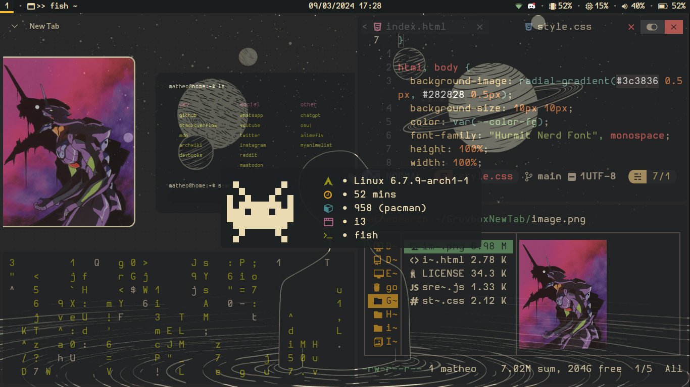

# My I3 DotFiles

You need more information?

## Programs
* **fish** - shell (and oh my fish)
* **kitty** - terminal
* **NeoVim (NvChad)** - text editor
* **polybar** - Status bar
* **ranger** - file explorer
* **rofi** - app launcher and powermenu
* **picom** - window animations (!(pijulius fork)[https://github.com/pijulius/picom])
* 
